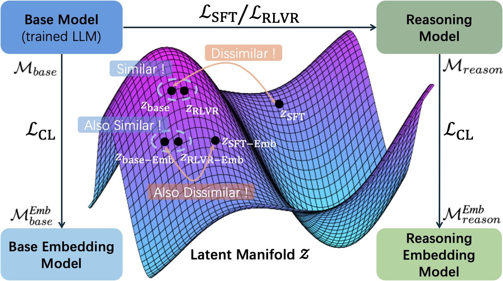
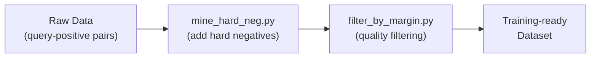
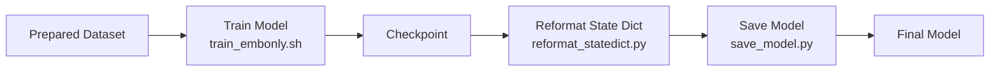

<div align="center">

# Do Reasoning Models Enhance Embedding Models?

<p align="center">
  <a href="https://arxiv.org/abs/2601.21192">
    
  </a>
  <a href="https://huggingface.co/collections/lucaswychan/reasoning-embedding">
    
  </a>
  
  <a href="https://huggingface.co/blog/transformers-v5">
    
  </a>
</p>

<br/>


</div>

## Introduction

State-of-the-art embedding models are increasingly derived from decoder-only Large Language Model (LLM) backbones adapted via contrastive learning. Given the emergence of reasoning models trained via Reinforcement Learning with Verifiable Rewards (RLVR), a natural question arises: do enhanced reasoning translate to superior semantic representations when these models serve as embedding initializations? Contrary to expectation, our evaluation on MTEB and BRIGHT reveals a **null effect**: embedding models initialized from RLVR-tuned backbones yield no consistent performance advantage over their base counterparts when subjected to identical training recipes. To unpack this paradox, we introduce **H**ierarchical **R**epresentation **S**imilarity **A**nalysis (HRSA), a framework that decomposes similarity across representation, geometry, and function levels. HRSA reveals that while RLVR induces irreversible latent manifold's local geometry reorganization and reversible coordinate basis drift, it preserves the global manifold geometry and linear readout. Consequently, subsequent contrastive learning drives strong alignment between base- and reasoning-initialized models, a phenomenon we term **Manifold Realignment**. Empirically, our findings suggest that unlike Supervised Fine-Tuning (SFT), RLVR optimizes trajectories within an existing semantic landscape rather than fundamentally restructuring the landscape itself.

## 📑 News

**[2026.01.30]** Our paper is published on [Arxiv](https://arxiv.org/abs/2601.21192)! Models and data are available on [HuggingFace](https://huggingface.co/collections/lucaswychan/reasoning-embedding).

## 🚀 Quick Start

Clone the repository and initialize the submodule:

```bash
git clone --recurse-submodules https://github.com/lucaswychan/reasoning-embedding.git
cd reasoning-embedding
```

Install dependencies using either `uv` (recommended) or `pip`:

```bash
# Method 1: Using uv (Install uv first: https://docs.astral.sh/uv/getting-started/installation/)
uv sync
source .venv/bin/activate
uv pip install flash-attn --no-build-isolation

# Method 2: Using pip
python3 -m venv .venv
source .venv/bin/activate
pip install -r requirements.txt
pip install flash-attn --no-build-isolation
```

**⚠️ Important:** Enable bidirectional attention (required for embedding models):

```bash
# Method 1: For transformers>=5.0.0 (default in requirements.txt and recommended.)
cp models/modeling_qwen2.py .venv/lib/python3.12/site-packages/transformers/models/qwen2/modeling_qwen2.py
cp models/modeling_qwen3.py .venv/lib/python3.12/site-packages/transformers/models/qwen3/modeling_qwen3.py

# Method 2: For transformers<5.0.0 (unless you manually changed the version, otherwise you can ignore it.)
cp models/modeling_qwen2_v4.py .venv/lib/python3.12/site-packages/transformers/models/qwen2/modeling_qwen2.py
cp models/modeling_qwen3_v4.py .venv/lib/python3.12/site-packages/transformers/models/qwen3/modeling_qwen3.py
```

## 📦 Installation & Setup

### Bidirectional Attention for Embedding Models

Embedding models require bidirectional attention, which is achieved by setting `is_causal=False` in the model's forward pass. We provide modified [`modeling_qwen2.py`](models/modeling_qwen2.py) and [`modeling_qwen3.py`](models/modeling_qwen3.py) files with the necessary changes.

**What we changed:** Added an `is_causal` argument to all `forward` methods and set `is_causal=False` by default in the `XXXModel` class. Example modification:

```python
class Qwen2Model(Qwen2PreTrainedModel):
    def forward(
        self,
        input_ids: Optional[torch.LongTensor] = None,
        attention_mask: Optional[torch.Tensor] = None,
        ...
        is_causal: Optional[bool] = False,  # Added: enables bidirectional attention
        **kwargs,
    ) -> BaseModelOutputWithPast:
        ...
        for decoder_layer in self.layers:
            hidden_states = decoder_layer(
                hidden_states,
                ...
                is_causal=is_causal,  # Added: pass to decoder layers
                **kwargs,
            )
```

**Important:** Use Flash Attention 2 as the attention backend. The SDPA backend has a bug that prevents bidirectional attention even with `is_causal=False`. See [transformers#39554](https://github.com/huggingface/transformers/issues/39554) for details.

**For other model families** (e.g., DeepSeek, Llama): Apply the same modifications—add `is_causal` to all `forward` methods and set `is_causal=False` in the base model class.

**Ignore the documentation error:** If you received the following error (or something like that):
```
[ERROR] `is_causal` is part of Qwen2Model.forward's signature, but not documented. Make sure to add it to the docstring of the function in <repo_path>/.venv/lib/python3.12/site-packages/transformers/models/qwen2/modeling_qwen2.py.
```
Just ignore it. It's even a good sign to indicate your success in setting up the bidirectional attention.

## 📁 Project Structure

```text
.
├── datasets/                     # Dataset processing and preparation
│   ├── mine_hard_neg.py          # Hard negative mining for contrastive learning
│   ├── filter_by_margin.py       # Margin-based dataset filtering
│   └── cot-datasets/             # Chain-of-Thought dataset generation (for analysis)
├── evaluation/                   # Embedding evaluation benchmarks
│   ├── evaluate_mteb.py          # MTEB benchmark evaluation
│   ├── evaluate_bright.py        # BRIGHT benchmark evaluation
│   └── summary.py                # Results summarization
├── hrsa/                         # Hierarchical Representation Similarity Analysis
│   ├── run_metrics.py            # Main CLI entry point for HRSA metrics
│   ├── metrics/                  # Metric implementations (CKA, Procrustes, etc.)
│   └── [metric_name].py          # Individual metric classes
├── models/                       # Modified model implementations
│   ├── modeling_qwen2.py         # Qwen2 with bidirectional attention support
│   └── modeling_qwen3.py         # Qwen3 with bidirectional attention support
├── scripts/                      # Evaluation scripts
│   ├── evaluate_mteb.sh
│   └── evaluate_bright.sh
└── train/gritlm-re/              # Embedding model training (modified GritLM)
```

## 🔬 HRSA Framework

The HRSA (Hierarchical Representation Similarity Analysis) framework decomposes model similarity across three levels: representation, geometry, and function. All metrics are implemented under the `hrsa/` directory.

### Available Metrics

| Metric | Description |
|--------|-------------|
| **Linear CKA** | Measures representation space similarity using centered kernel alignment |
| **Orthogonal Procrustes** | Finds optimal orthogonal transformations to align representation spaces |
| **Dimension-wise Correlation** | Computes Pearson correlations between corresponding dimensions |
| **k-NN Overlap** | Compares k-nearest neighbor sets to measure local geometry preservation |
| **Cross-Model Linear Probe** | Evaluates transfer of linear classifiers between model representations |

### Running HRSA Metrics

Use [`run_metrics.py`](hrsa/run_metrics.py) as the unified CLI entry point:

```bash
python3 hrsa/run_metrics.py \
    --metric linear_cka \
    --model_1 Qwen/Qwen2.5-1.5B \
    --model_2 hkust-nlp/Qwen-2.5-1.5B-SimpleRL-Zoo \
    --dataset HuggingFaceH4/MATH-500 \
    --dataset_split test \
    --text_column solution \
    --dataset_subset default \
    --num_sentences 500 \
    --device cuda:0 \
    --batch_size 4
```

Available metrics for the `--metric` flag:
- `linear_cka` - Linear CKA
- `procrustes` - Orthogonal Procrustes Analysis
- `correlation` - Dimension-wise Correlation
- `knn_overlap` - k-NN Overlap
- `linear_probe` - Cross-Model Linear Probe

### Output Structure

Results are saved to: `metric_results/<metric>/<model1>__vs__<model2>/<dataset>/`

Each metric generates:
- Configuration files (JSON)
- Visualization plots (PNG)
- Statistics tables (TSV/JSON)
- Raw data (PyTorch tensors)

## 📊 Dataset Preparation

### Training Data Pipeline



### Hard Negative Mining

Use [`mine_hard_neg.py`](datasets/mine_hard_neg.py) to mine hard negatives for contrastive learning:

```bash
python3 datasets/mine_hard_neg.py \
    --input_file data/queries-with-positives.jsonl \
    --output_file data/queries-with-hard-negatives.jsonl \
    --model_name Qwen/Qwen2.5-0.6B-Instruct \
    --num_negatives 3
```

**What it does:** Uses a reference embedding model (e.g., Qwen2.5-0.6B) to find challenging negative passages with small margins from positive passages.

### Margin-based Filtering

Use [`filter_by_margin.py`](datasets/filter_by_margin.py) to filter datasets by embedding quality:

```bash
python3 datasets/filter_by_margin.py \
    --input_file data/queries-with-hard-negatives.jsonl \
    --output_file data/filtered-dataset.jsonl \
    --margin_threshold 0.7 \
    --max_samples 350000
```

**What it does:** Filters examples where `positive_score - max(negative_scores) > threshold`, keeping high-quality training examples.

### Chain-of-Thought Dataset Generation (Optional)

The `datasets/cot-datasets/` directory contains tools for generating reasoning traces from math problems using Qwen3-32B. This is used for analyzing reasoning model outputs and is optional for embedding training.

## 🎯 Embedding Model Training

Training code is located in the `train/gritlm-re/` submodule (modified from [GritLM](https://arxiv.org/abs/2402.09906)). We use only the embedding training components (no generative training).

### Training Workflow



### Setup

Navigate to the training directory and install dependencies:

```bash
cd train/gritlm-re
uv venv .venv --python 3.12
source .venv/bin/activate
uv pip install -r requirements.txt
uv pip install flash-attn --no-build-isolation

# Optional: Install GradCache for memory-efficient training
cd gritlm/training/GradCache
uv pip install -e .
cd ../../..
```

### Training

Run the embedding-only training script:

```bash
bash scripts/training/train_embonly.sh
```

**Configuration:** Edit `scripts/configs/config_8gpusfsdp_qwen.yml` to adjust FSDP settings, GPU count, and other hyperparameters. All training arguments are documented in `gritlm/training/arguments.py`.

### Post-Training: Save Model

After training, reformat the state dict and save the final model:

```bash
# Step 1: Remove 'model.' prefix from state dict keys
python3 utils/reformat_statedict.py <checkpoint_path>

# Step 2: Save as safetensors format
python3 utils/save_model.py <checkpoint_path> \
    --base_model_name Qwen/Qwen2.5-1.5B \
    --is_peft  # Add this flag if using LoRA
```

## 📈 Embedding Model Evaluation

### Quick Reference

| Benchmark | Script | Description |
|-----------|--------|-------------|
| **MTEB** | `scripts/evaluate_mteb.sh` | Standard embedding benchmarks (Classification, Clustering, Retrieval, STS, etc.) |
| **BRIGHT** | `scripts/evaluate_bright.sh` | Domain-specific retrieval with hard negatives (Math, Science, Code, etc.) |

### Running Evaluations

```bash
# MTEB evaluation
bash scripts/evaluate_mteb.sh

# BRIGHT evaluation
bash scripts/evaluate_bright.sh
```

**Customize MTEB benchmark:** Edit the `benchmark` variable in `scripts/evaluate_mteb.sh`:

```bash
benchmark="MTEB(Multilingual, v2)"
# benchmark="RTEB(beta)"
# benchmark="MTEB(Code, v1)"
```

### Results Location

Results are saved to: `metric_results/mteb_results/<model_name>/results/<model_full_name>/<model_revision>/`

### Summarize Results

Analyze and print evaluation results:

```bash
python3 evaluation/summary.py \
    metric_results/mteb_results/<model_name>/results/<model_full_name>/<model_revision> \
    --benchmark "MTEB(Multilingual, v2)"
```

## 📚 Citation

If you find this work useful, please cite our paper:

```bibtex
@misc{chan2026reasoningmodelsenhanceembedding,
      title={Do Reasoning Models Enhance Embedding Models?}, 
      author={Wun Yu Chan and Shaojin Chen and Huihao Jing and Kwun Hang Lau and Elton Chun-Chai Li and Zihao Wang and Haoran Li and Yangqiu Song},
      year={2026},
      eprint={2601.21192},
      archivePrefix={arXiv},
      primaryClass={cs.AI},
      url={https://arxiv.org/abs/2601.21192}, 
}
```

## 📞 Contact

Lucas Wun Yu CHAN  
lucaswychanlc@gmail.com / wychanbu@connect.ust.hk

